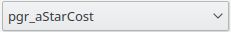
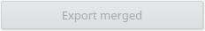

# pgr_astarCost


|Button|Action|
| ----------- | --------- |
||Opens the web page of the documentation of pgr_astarCost|
|| Choose pgr_astarCost on the drop down box|

## Edges SQL tab


|Field|Action|
| ----------- | --------- |
|| Write the table name of the edges|
||Write the schema of the edge table|
||Write the geometry column name|
||Tick to use the  Bounding Box of the QGIS canvas to limit the rows of edge table |

### Columns

|Field|Action|
| ----------- | --------- |
|| Write the column that has the edge identifier|
||Write the column that has the edge source|
||Write the column that has the edge target|
||Write the column that has the cost of the edge source -> target|
||Write the column that has the cost of the edge target -> source, the column will be used when the box is ticked |

## Arguments tab


|Field|Action|
| ----------- | --------- |
|| Choose with  or write the comma separated identifiers of the start vertices|
||Choose with  or write the comma separated identifiers of the destination vertices|
|| Heuristic number. Current valid values `0~5` . Default ``5``|
|| For units manipulation.  `factor > 0`.  Default  ``1``. See  `astar_factor`.|
|| For less restricted results. `epsilon >= 1`.  Default ``1``.|
|| Tick if the graph is directed |

## Execute tab 


|Button|Action|
| ----------- | --------- |
|| Draws in the canvas the resulting path |
|| Removes from the canvas objects generated with Preview|
|| Creates a one row per edge line geometry layer|
|| Disabled|

Depending on the pressed button the layer name will be 
```
(<U|D>) pgr_astarCost: <source_id>  to <target_id>  BBOX(<bbox>)
```