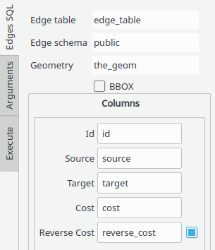
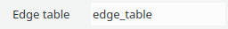
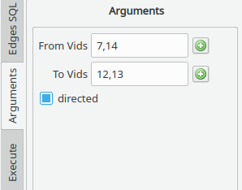
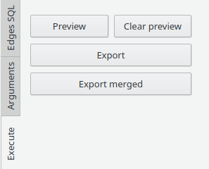

# pgr_dijkstra

- Uses BBOX of the QGIS canvas to limit the resulting path(s):


## Edges SQL tab


|Field|Action|
| ----------- | --------- |
|| Write the table name of the edges|
||Write the schema of the edge table|
||Write the geometry column name|

## Arguments tab


|Field|Action|
| ----------- | --------- |
|| Choose or write the comma separated identifiers of the start vertices|
||Choose or write the comma separated identifiers of the destination vertices|

## Execute tab 


|Button|Action|
| ----------- | --------- |
|| Draws in the canvas the resulting path |
|| Removes from the canvas objects generated with Preview|
|| Creates a one row per edge line geometry layer|
|| Creates a one row per path multiline geometry layer. As many rows as needed|

Depending on the pressed button the layer name will be 
```
(<U|D>) pgr_dijkstra: <source_id>  to <target_id>  BBOX(<bbox>)
(M <U|D>) pgr_dijkstra: <source_id>  to <target_id>  BBOX(<bbox>)
```