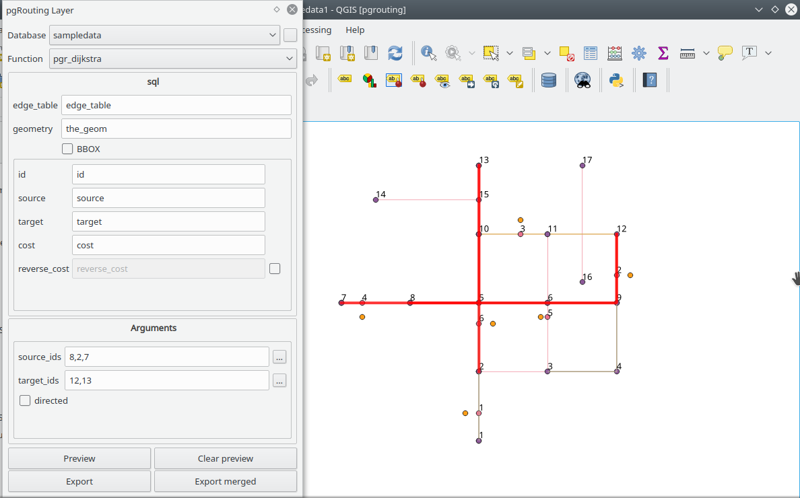

# pgr_dijkstra

- Uses BBOX of the QGIS canvas to limit the resulting path(s)

- Buttons:
  - : Draws in the canvas the resulting path
  - : Removes from the canvas objects generated with Preview
  - : Creates a one row per edge line geometry layer
  	- Layer name:
	```
	(< U|D >) pgr_dijkstra: < source_id >  to < target_id>  BBOX(< bbox >)
	```
  - : Creates a one row per path multiline geometry layer. As many rows as needed.
	- Layer name:
	```
	(M < U|D >) pgr_dijkstra: < source_id >  to < target_id>  BBOX(< bbox >)
	```


